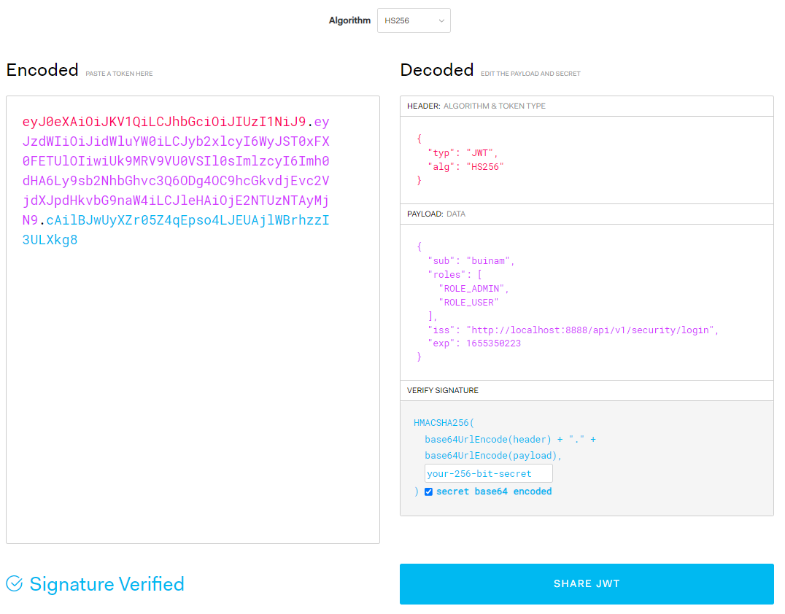
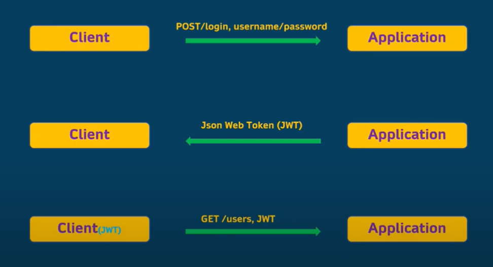

# Spring Boot and Spring Security with JSON Web Token (JWT) including Access and Refresh Tokens

# What is JWT?
Your application is going to give the user a token that they can use as their authorization to access the protected resources.

## Authentication (verifies you are who you say you are)
Authentication is the process of validating the user's credentials and giving them the right access and sending them a token.

Method:
    -   Login form
    -   HTTP Basic Authentication
    -   Custom Authentication method

## Authorization (decides if you have permission to access the resource)
Authorization is the process of validating the user's token and granting them access to the protected resources based on the token.

Method:
    -   Access Control List (ACL)
    -   Access Control URLs

## 3 parts of JWT

### 1/3 Header
The header is the first part of the JWT. It contains the type of token, the algorithm used to sign the token, and the key used to sign the token.

### 2/3 Payload
The payload is the second part of the JWT. It contains the user's information (userName, email, role, expiredAt,...) . It can contain anything you want. It is the data that is encrypted and signed. 

### 3/3 Signature
The signature is the last part of the JWT. It contains the signature of the JWT. It is used to verify that the JWT is valid. The way it works is that you have to encrypt the JWT with the same (secret) key you used to sign it.

### An example of a JWT


# Security with JSON Web Token (JWT)

Here is sample flow when you secure your application with JWT:

    -   User logs in
    -   User is authenticated
    -   User is authorized 
    -   User gets a token
    -   User makes a request to the protected resource
    -   User receives a response



# Model
In this project we will create a user model and a role model:

Note that we will named "AppUser" to avoid confusion with the "User"  that comes with Spring Security.
### AppUser
```
@Entity
@Data
@NoArgsConstructor
@AllArgsConstructor
public class AppUser {
    @Id
    @GeneratedValue(strategy = AUTO)
    private Long id;
    private String name;
    private String username;
    private String password;
    // load the role collection when the user is loaded at the same time
    @ManyToMany(fetch = FetchType.EAGER)
    private Collection<Role> roles = new ArrayList<>();
}
```

### Role
```
@Entity
@Data
@NoArgsConstructor
@AllArgsConstructor
public class Role {
    @Id
    @GeneratedValue(strategy = AUTO)
    private Long id;
    private String name;

}
```

# Service and Implementation