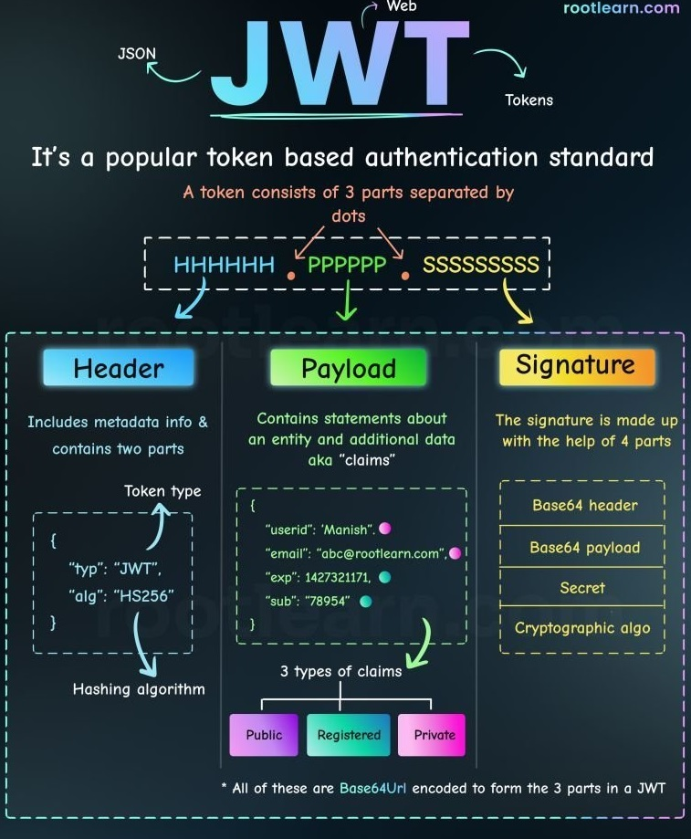
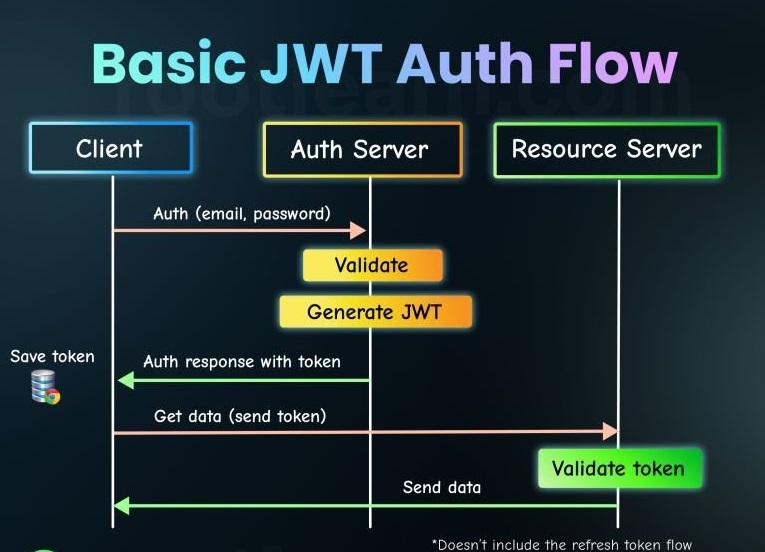

# Spring Boot and Spring Security with JSON Web Token (JWT) including Access and Refresh Tokens

🖥️ Live app for demo: [https://i-calender.vercel.app/](https://i-calender.vercel.app/) 

# If you're looking for Spring-Security-LDAP, please visit this repository:
https://github.com/buikhacnam/Spring-Security-LDAP

# What is JWT?
JSON Web Token (JWT) is a standard for representing claims in JSON. It is a compact, self-contained, signed JSON object. It is used to represent claims in the form of a string of characters. 
Basically, it is a JSON object that is signed with a secret key. The secret key is used to verify the authenticity of the JWT.



## 3 parts of JWT

### 1/3 Header

The header is the first part of the JWT. It contains the type of token, the algorithm used to sign the token, and the key used to sign the token.

### 2/3 Payload

The payload is the second part of the JWT. It contains the user's information (userName, email, role, expiredAt,...) . It can contain anything you want. It is the data that is encrypted and signed.

### 3/3 Signature

The signature is the last part of the JWT. It contains the signature of the JWT. It is used to verify that the JWT is valid. The way it works is that you have to encrypt the JWT with the same (secret) key you used to sign it.

### An example of a JWT


## Authentication (verifies you are who you say you are)

Authentication is the process of validating the user's credentials and giving them the right access and sending them a token.

Method:
- Login form
- HTTP Basic Authentication
- Custom Authentication method

## Authorization (decides if you have permission to access the resource)

Authorization is the process of validating the user's token and granting them access to the protected resources based on the token.

Method:
- Access Control List (ACL)
- Access Control URLs

# Security with JSON Web Token (JWT)

Here is sample flow when you secure your application with JWT:

    -   User logs in
    -   User is authenticated
    -   User is authorized
    -   User gets a token
    -   User makes a request to the protected resource
    -   User receives a response




# User Model

In this project we will create a user model and a role model:

Note that we will named "AppUser" to avoid confusion with the "User" that comes with Spring Security.

### AppUser

```
@Entity
@Data
@NoArgsConstructor
@AllArgsConstructor
public class AppUser {
    @Id
    @GeneratedValue(strategy = AUTO)
    private Long id;
    private String name;
    private String username;
    private String password;
    // load the role collection when the user is loaded at the same time
    @ManyToMany(fetch = FetchType.EAGER)
    private Collection<Role> roles = new ArrayList<>();
}
```

### Role

```
@Entity
@Data
@NoArgsConstructor
@AllArgsConstructor
public class Role {
    @Id
    @GeneratedValue(strategy = AUTO)
    private Long id;
    private String name;

}
```

# Example of users and roles

```
[
    {
        "id": 31,
        "name": "Bui Nam",
        "username": "buinam",
        "password": "$2a$10$uf7rRRgx.heMemRkiIP7kODJOAX4XgAcjYSRh1c1vcH7wKaIDqtSq",
        "roles": [
            {
                "id": 28,
                "name": "ROLE_ADMIN"
            },
            {
                "id": 29,
                "name": "ROLE_USER"
            }
        ]
    },
    {
        "id": 32,
        "name": "Frank Lampard",
        "username": "lampard",
        "password": "$2a$10$YOQilvfTo30rGfQTrpcooeNsdzhynpWTMNFxN17Yr8WH8/cCbSwua",
        "roles": [
            {
                "id": 29,
                "name": "ROLE_USER"
            }
        ]
    },
    ...
]
```

# Necessary Beans for Security Configuration

## BCryptPasswordEncoder

We can add the bean in the main application class:

```
import org.springframework.security.crypto.bcrypt.BCryptPasswordEncoder;

	@Bean
	BCryptPasswordEncoder passwordEncoder() {
		return new BCryptPasswordEncoder();
	}
```

## UserDetailsService

In our service.AppUserServiceImpl class, we will extend the UserDetailsService interface and override the 'loadUserByUsername' method. This methid will return a Spring Security User object.

```

import org.springframework.security.core.authority.SimpleGrantedAuthority;
import org.springframework.security.core.userdetails.User;
import org.springframework.security.core.userdetails.UserDetails;
import org.springframework.security.core.userdetails.UserDetailsService;
import org.springframework.security.core.userdetails.UsernameNotFoundException;

public class AppUserServiceImpl implements AppUserService, UserDetailsService {

    @Autowired
    private final AppUserRepository appUserRepository;

    @Override
    public UserDetails loadUserByUsername(String username) throws UsernameNotFoundException {
        AppUser user = appUserRepository.findByUsername(username);

        if (user == null) {
            String errorMessage = "User not found with username: " + username;
            log.error(errorMessage);
            throw new UsernameNotFoundException(errorMessage);
        } else {
            log.info("User found: {}", user);
        }

        Collection<SimpleGrantedAuthority> authorities = JwtUtils.getAuthorities(user.getRoles());
        log.info("User authorities: {}", authorities); //User authorities: [ROLE_USER, ROLE_ADMIN]

        return new User(user.getUsername(), user.getPassword(), authorities);
    }

    ...
```

# Security Configuration

Code can be found in security.SecurityConfig class.

The SecurityConfig Class extends WebSecurityConfigurerAdapter and We will override these 2 methods of its:

```
@Configuration
@EnableWebSecurity
@RequiredArgsConstructor

public class SecurityConfig extends WebSecurityConfigurerAdapter {
    private final UserDetailsService userDetailsService;
    private final BCryptPasswordEncoder bCryptPasswordEncoder;
    private final CustomAuthorizationFilter customAuthorizationFilter;

    @Override
    protected void configure(AuthenticationManagerBuilder auth) throws Exception {
        auth.userDetailsService(userDetailsService).passwordEncoder(bCryptPasswordEncoder);
    }

    @Override
    protected void configure(HttpSecurity http) throws Exception {
        CustomAuthenticationFilter customAuthenticationFilter = new CustomAuthenticationFilter(authenticationManagerBean());
        customAuthenticationFilter.setFilterProcessesUrl("/api/login");
        http.csrf().disable();
        http.sessionManagement().sessionCreationPolicy(STATELESS);
        http.authorizeRequests().antMatchers("/api/login/**", "/api/token/refresh/**", "/api/user/save/**").permitAll();
        http.authorizeRequests().antMatchers(GET, "/api/users/**").hasAnyAuthority("ROLE_SUPER_ADMIN", "ROLE_ADMIN");
        http.authorizeRequests().antMatchers(POST, "/api/role/addtouser/**").hasAnyAuthority("ROLE_ADMIN");
        http.authorizeRequests().anyRequest().authenticated();
        http.addFilter(customAuthenticationFilter);
        //this filter will come first and before other filers
        http.addFilterBefore(customAuthorizationFilter, UsernamePasswordAuthenticationFilter.class);
    }

    @Bean
    @Override
    public AuthenticationManager authenticationManagerBean() throws Exception {
        return super.authenticationManagerBean();
    }
}

```

# Filters

## CustomAuthenticationFilter

The class will extend the `org.springframework.security.web.authentication.UsernamePasswordAuthenticationFilter` class.

Every time a user tries to login, the filter will be called.

```
import org.springframework.security.authentication.UsernamePasswordAuthenticationToken;
import org.springframework.security.authentication.AuthenticationManager;
import org.springframework.security.core.userdetails.User;

@Autowired
private final AuthenticationManager authenticationManager;

public class CustomAuthenticationFilter extends UsernamePasswordAuthenticationFilter {
    @Override
    public Authentication attemptAuthentication(HttpServletRequest request, HttpServletResponse response) throws AuthenticationException {
        // this will get the credentials from the request
        // then we will use the credentials to authenticate the user:
        UsernamePasswordAuthenticationToken authenticationToken = new UsernamePasswordAuthenticationToken(username, password);
    
        // Eventually this will call UserDetailServiceImpl.loadUserByUsername() by return below:
        return authenticationManager.authenticate(authenticationToken);
    
    }
    
    
    @Override
    protected void successfulAuthentication(HttpServletRequest request, HttpServletResponse response, FilterChain chain, Authentication authentication) throws IOException, ServletException {
    
        // this method will run once the user is authenticated successfully
        // this will genarate a access Token and a refresh Token based on the user's information (org.springframework.security.core.userdetails.User) and the HttpServletRequest
        // you may want to send the token to the client in the response
    
    }
    
    @Override
    protected void unsuccessfulAuthentication(HttpServletRequest request, HttpServletResponse response, AuthenticationException failed) throws IOException, ServletException {
        // you can also run this if the user is not authenticated successfully
    }
}
```

## CustomAuthorizationFilter

The class will extend the `org.springframework.web.filter.OncePerRequestFilter` class.

This filter will intercept every request and check if the user is authenticated.

```
public class CustomAuthorizationFilter extends OncePerRequestFilter {
    @Override
    protected void doFilterInternal(HttpServletRequest request, HttpServletResponse response, FilterChain filterChain) throws ServletException, IOException {
        // first we will check if the coming request is a protected resource
        // if not (ex: login, signup,...), we will just pass the request to the next filter
    
        // else (ex: protected resource), we will check if the user is authenticated:
        // first, we will get the token from the request header
        // then we will check if the token is valid
        // if the token is valid, we will get the user from the token (username and authorities)
        // then we will athenticate the user by username and authorities
        org.springframework.security.authentication.UsernamePasswordAuthenticationToken authenticationToken =
                                new org.springframework.security.authentication.UsernamePasswordAuthenticationToken(username, null, authorities);
    
        // Next, we will take the result from authentication above tell the Spring Security: "hey, this is the user, here's the username, here's the authorities. I'm authenticated"
        // the Spring will look at this user and their authorities and will decide if the user is authorized to access the resource:
        SecurityContextHolder.getContext().setAuthentication(authenticationToken);
    
        // finally, we will pass the request to the next filter
        filterChain.doFilter(request, response);
    }
}

```

# JWT Utilities

The project uses Java JWT:

```
<!-- https://mvnrepository.com/artifact/com.auth0/java-jwt -->
<dependency>
    <groupId>com.auth0</groupId>
    <artifactId>java-jwt</artifactId>
    <version>3.18.1</version>
</dependency>
```

First we define the secret key: (please save it to a safe place in production).
Then, we define algorithms that will be used to generate and validate tokens.
Next, we have verifier that will be used to validate tokens
```
private final static String SECRET = "secret";
private final static Algorithm algorithm = Algorithm.HMAC256(SECRET.getBytes());
private final static JWTVerifier verifier = JWT.require(algorithm).build();
```

Create token by using data from org.springframework.security.core.userdetails.User or com.buinam.userservice.model.AppUser.

```
    //generate token from userDetails
    public static String generateAccessToken(User user, HttpServletRequest request) {
        return JWT.create()
                .withSubject(user.getUsername())
                .withExpiresAt(new Date(System.currentTimeMillis() + 10 * 60 * 1000)) // 10 minutes
                .withIssuer(request.getRequestURL().toString())
                .withClaim("roles", user.getAuthorities().stream().map((GrantedAuthority g) -> g.getAuthority()).collect(Collectors.toList()))
                .sign(algorithm);
    }

    //generate token from user model
    public static String generateAccessToken(AppUser user, HttpServletRequest request) {
        return JWT.create()
                .withSubject(user.getUsername())
                .withExpiresAt(new Date(System.currentTimeMillis() + 10 * 60 * 1000))
                .withIssuer(request.getRequestURL().toString())
                .withClaim("roles", user.getRoles().stream().map((Role role) -> role.getName()).collect(Collectors.toList()))
                .sign(algorithm);
    }

```

Here's how to verify a token:

```
public static DecodedJWT verifyToken(String token) {
    return verifier.verify(token);
}
```

Here's how to get the username from a decoded token:

```
    public static String getUserName(DecodedJWT decodedJWT) {
        return decodedJWT.getSubject();
    }
```

Here's how to get the authorities from a decoded token:

```
public static Collection<SimpleGrantedAuthority> getAuthorities(DecodedJWT decodedJWT) {
    String[] roles = decodedJWT.getClaim("roles").asArray(String.class);
    Collection<SimpleGrantedAuthority> authorities  = new ArrayList<>();
    Arrays.stream(roles).forEach(role -> {
        authorities.add(new SimpleGrantedAuthority(role));
    });
    return authorities;

}
```


